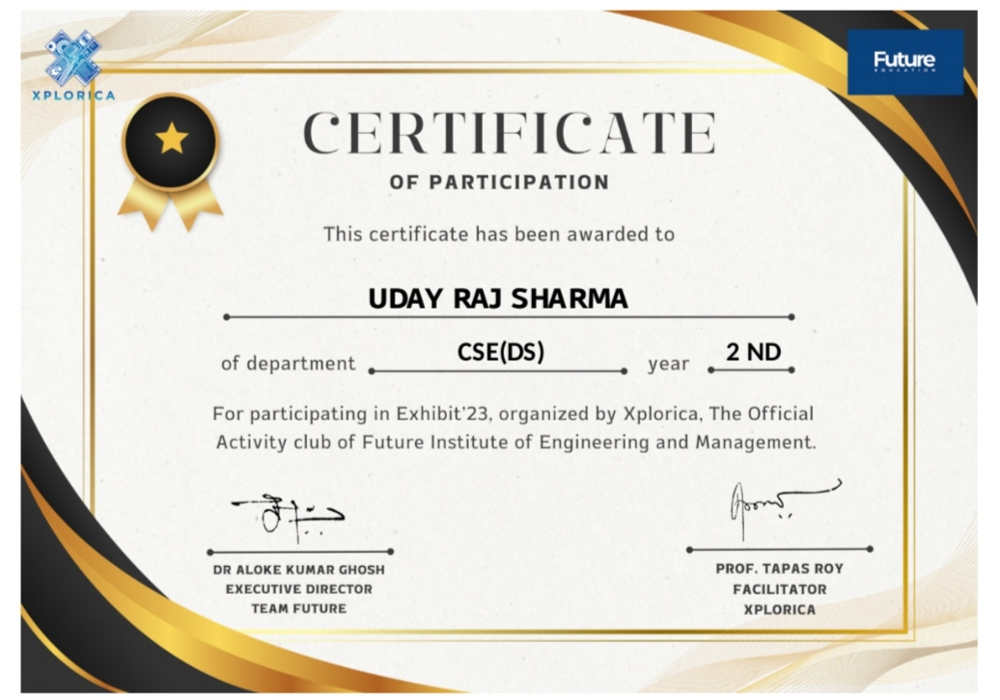

# Project: CHATBOT AI
## Objective:
To develop a versatile and intelligent chatbot AI using the OpenAI GPT API, similar to Amazon Alexa or iPhone’s Siri, that can assist users in various tasks, provide information, and engage in natural conversations.The assistant will be integrated into various platforms, including mobile devices, smart home systems, and wearable technology, making it accessible and versatile for users in different contexts.
# KEY FEATURES
## 1.Third-Party Integration:
CHATBOT AI will support integration with third-party applications and services, such as music streaming platforms, e-commerce sites, social media, and more. This will allow users to control these services using voice commands.
## 2.Voice Interaction:
Integrate with speech-to-text (STT) and text-to-speech (TTS) technologies to allow seamless voice interaction.
## 3.Multiplatform Support:
Deploy the chatbot on various platforms, including mobile apps (iOS and Android), desktop applications, web browsers, and smart home devices.
## Customizable Wake Word:
Allow users to choose a custom wake word (similar to “Alexa” or “Hey Siri”) to trigger the chatbot.

# Potential Use Cases:

## Home Assistant:
Manage daily tasks, control smart devices, and provide real-time information.
## Customer Support:
Serve as a first point of contact for customer inquiries and issue resolution.
## Learning Assistant:
Help students with study material, answer questions, and provide educational resources.
## Virtual Concierge:
Assist in booking appointments, making reservations, and providing recommendations.

### This project aims to create a versatile, intelligent, and user-friendly chatbot AI that can serve a wide range of applications, enhancing user convenience and accessibility through advanced AI and voice interaction technology.

### Participant's Certificate
 
